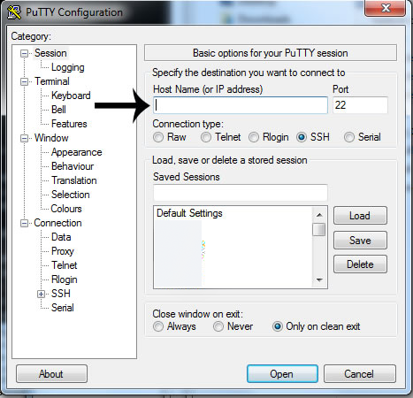

## ورود به سامانه کلاستر (از ویندوز)

روش ورود به کلاستر با اس‌اس‌اچ است. برای ورود در کامپیوترهای ویندوزی باید نرم‌افزار [پاتی](https://the.earth.li/~sgtatham/putty/latest/x86/putty-0.67-installer.msi)
را دانلود نمایید

بعد از دانلود مطابق عکس آدرس‌های زیر را وارد کنید

<div style="text-align:center"></div>

به جای فلس باید عبارت زیر را وارد کنید و به جای **یوزرنیم** عبارتی که برای شما به عنوان نام کاربری ذکر شده است را وارد کنید

```
USERNAME@login.hpc.tafreshu.ac.ir
```
بعد از درخواست، **پسورد آن را وارد کنید**

## ورود به سامانه کلاستر (از گنو/لینوکس)

کافی است در خط فرمان دستور زیر را وارد و به جای **یوزرنیم** نام کاربری خود را بزنید

```bash
ssh USERNAME@login.hpc.tafreshu.ac.ir
```
بعد از درخواست، **پسورد آن را وارد کنید**

## موفقیت بعد از ورود

اگر شما وارد کلاستر شدید به شما پیام خوش‌امد گویی می‌دهد. لطفا قبل از کار با آن [قوانین]() را به دقت بخوانید


## برنامه‌ها نصب شده

کلاستر صالحی یک کلاستر یک‌پارچه است؛ به این معنا که انجام وظیفه برنامه شما ممکن است توسط هر کامپیوتر رخ دهد که خالی باشد. 
این چندین خوبی و یک بدی نیز دارد.
بدی آن این است که برنامه‌ها تنها توسط ما باید نصب گردد. زیرا این ماشین با مجازی ساز کار نمی کند تا شما بتوانید ماشین خود را تنظیم کنید. شاید
با خود بگویید که خوب نباشد اما این گونه نیست. فرض کنید ما کلاستر را به ۲۰ ماشین مجازی تقسیم کنیم؛ در این صورت
شما تنها می‌توانید از ماشین خود استفاده کنید و خیلی محدود. حال که در سامانه ما شما به تمام ماشین‌ها دسترسی دارید و هنگامی که خالی باشد برنامه شما
روی کل ماشین اجرا می‌گردد

لیست برنامه‌های نصب شده

|Software|Version|
|:------:|:-----:|
|Quantum Espresso|5.1|
|SIESTA|4.0|
|MATLAB(R)|R2014b|

## سامانه مدیریت جاب

کلاستر شاهرود از سامانه مدیریت جاب بسیار قدرتمند بهره می‌برد که تاکنون در کشور از آن استفاده نشده. این سامانه همانند [تورک](https://en.wikipedia.org/wiki/TORQUE) است ولی قدرت بسیار بیشتری دارد

هدف از طراحی این وب‌سایت روش استفاده از این سامانه است.